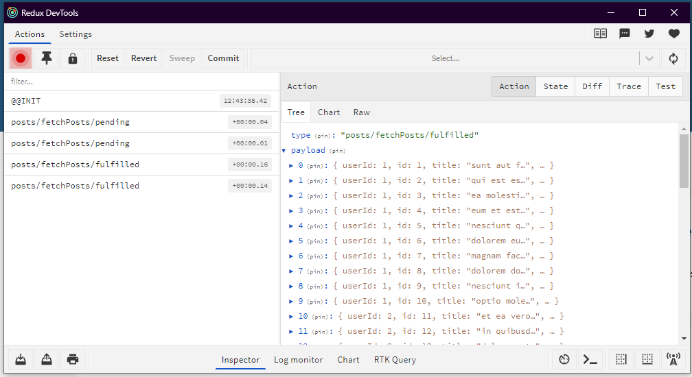
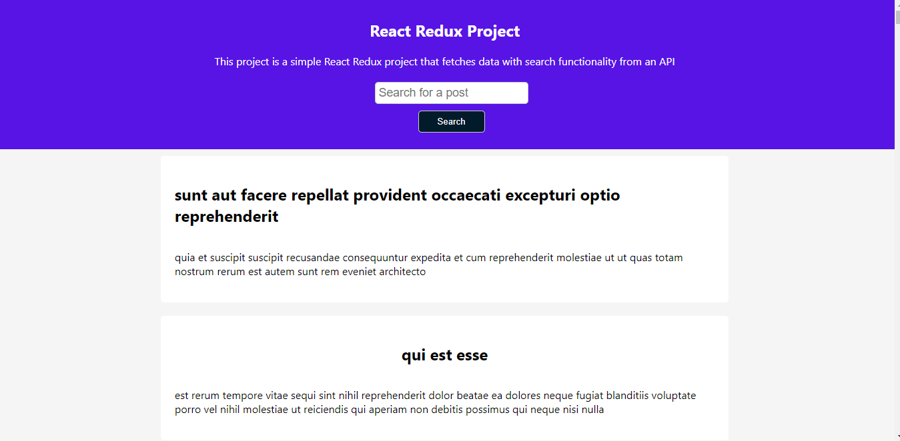

# REDUX TOOLKIT POST APP

Implemented this by using redux toolkit with create Async Thunk which handled the api part and i also used this for the search functionality. 

I implemented error handling from the API so when there is a wrong api, it is outputted on the page using conditional statement. 

I also used the json-typi-code dummy api just to have a working demo app for display.

I used the devtool for debugging and monitoring app state and action.

Redux Devtool for monitoring the api state and action. Helps with debugging.

the website built with redux and createAsyncThunk
